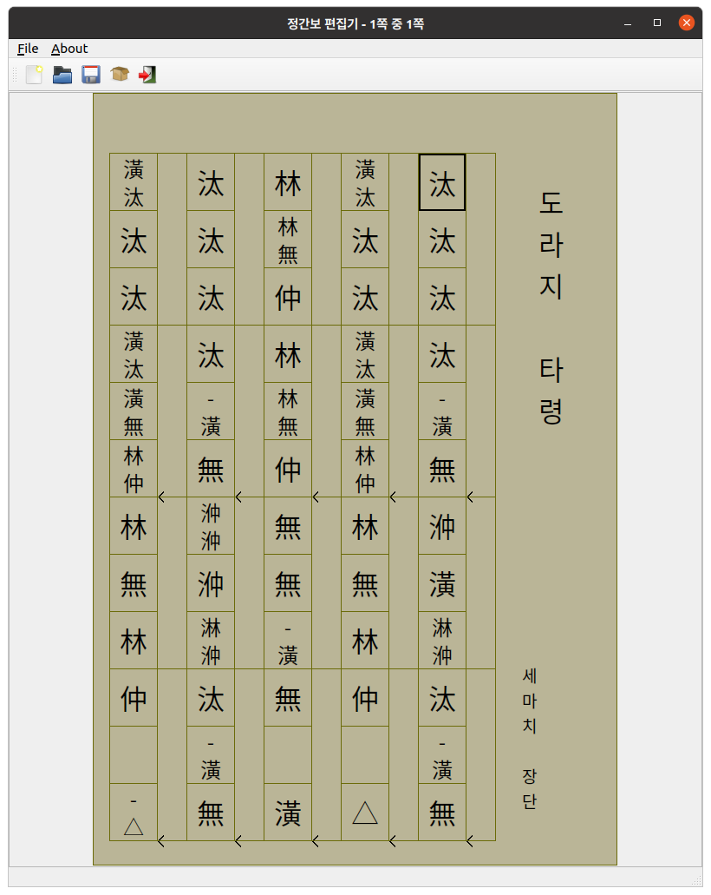
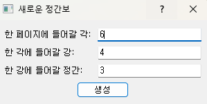
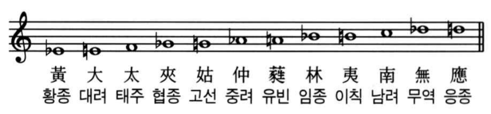
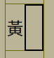
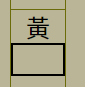
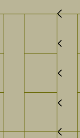
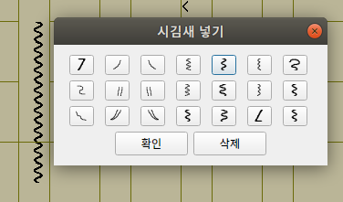
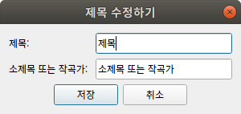

# Jeongganbo (정간보) Editor

 
 ## Download
[https://github.com/depth221/Jeongganbo-editor/releases/](https://github.com/depth221/Jeongganbo-editor/releases/)

※ To use on macOS, download the **Linux executable**.

## Introduction
So far, there are two Jeongganbo editors: [**Jeongganbo Mania**](https://blog.naver.com/jgb_mania/40041295964), which was released jointly by the Mogence Lab, Chonnam National University, and Dankook University in 2007, and Jeongganbo Project, which was created by an individual developer around 2011.

However, Jeongganbo Mania does not support the latest operating systems such as Windows 10 because of no longer updates, and the professional version was sold not free, but there is currently no way to purchase the professional version officially.

The Jeongganbo Project also recently lost its download link, and there's no official way to get it.

As a result, many people now use a word processor (Hancom Office, MS Word, etc.) rather than using a dedicated charting program to compose Jeongganbo. Although it's not too difficult to compose a Jeongganbo with a word processor, there is a problem that one need to obtain and insert image files of various the 'sigimsae (시김새)'s and decorative sounds separately.

In this situation, I created a simple **Jeongganbo editor** that is faster than using a word processor, does not require the preparation of the images, and can be used on operating systems other than Windows.

There are many shortcomings compared to existing Jeongganbo composing programs, but if you can tell us about any inconveniences or improvements, I'll do my best to reflect them.

## How to use
### Create a new Jeongganbo page

You can press `Ctrl+N` to create a new sheet, where you can set the 'gak to be on one page', 'gang to be on one gak', and 'jeonggan to be on one gang', but you can't change these settings after creating the sheet.

### Enter notes and rests
    
Each note is assigned to keys 1-5, and pressing a number key with the Ctrl key enters one higher note, and pressing it with the Alt key enters one lower note. 

`1`: Hwangjong (황종, **黃**鐘)    
`Ctrl+1`, `Alt+2`: Daeryeo (대려, **大**呂)     
`2`: Taeju (태주, **太**簇)     
`Ctrl+2`: Hyeopjong (협종, **夾**鐘)    
`Alt+3`: Goseon (고선, **姑**洗)    
`3`: Jungryeo (중려, **仲**呂)     
`Ctrl+3`, `Alt+4`: Yubin (유빈, **蕤**賓)    
`4`: Imjong (임종, **林**鐘)    
`Ctrl+4`: Ichik (이칙, **夷**則)    
`Alt+5`: Namryeo (남려, **南**呂)    
`5`: Muyeok (무역, **無**射)    
`Ctrl+5`, `Alt+1`: Eungjong (응종, **應**鐘)    

Pressing the \` key (tilde key) will lock the inserted note one octave up, and pressing the Shift+\` key will lock it one octave down. Supported from -2 to 2 octaves.

`-` key to enter a connected sound, and `space` to enter a rest (△).

The `delete` key clears the contents of the clicked cell, and the `backspace` key removes the cell itself.

### Enter an grace note
Right-clicking in the clicked space will bring up a list of grace notes, where you can select the grace note you want to enter.

### Insert a new space
If you enter a series of notes, the slots will automatically adjust to fit 1-6 beats. If you want the notes to look a certain way, you can set the shape of the cells yourself, as shown below.

    
Pressing `Ctrl+→` creates a new cell to the right of the currently clicked cell.

    
Pressing `Ctrl+space` creates a new space below the currently clicked space.

### Enter a breathing mark
    
Clicking on the left part of the empty space to the right of the space will enter a breathing mark. Press it again to make it disappear.

### Enter a sigimsae
    
Clicking on the right part of the empty space to the right of the gutter will bring up a window for entering sigimsaes. This is where you can enter the desired sigimsae. Pressing the buttons consecutively will enter sigimsaes continuously.

### Edit title-subtitle and author
    
You can edit the title and author as shown above by clicking on the title and subtitle section on the right side of the page.

### Turning pages
You can press the `Page Up` (`PgUp`) key to go to the previous page and the `Page Down` (`PgDn`) key to go to the next page.    
Also, if you reach the end of a page while writing notes, it will automatically go to the next page.

### Save / Open
Save a Jeongganbo project file (.jgbx) with `Ctrl+S` (not an image file!). You can recall a saved project file with `Ctrl+O`.

### Export
You can export sheets as an image (.png) file with `Ctrl+E`. Each page will be saved as one image file.

## installing oneself
### Dependencies
* Python 3.10
* PyQt5
* BeautifulSoap
* pyinstaller (Only when creating an executable)

### Windows
※ You must install pip first!
```powershell
pip install -r requirement.txt
.\make_exe.cmd
```

The executable file is located in the `dist\jeongganbo_editor` folder.

### Mac
※ You must install homebrew first!
```bash
sudo easy_install pip
pip install -r requirement.txt
./make_exe.sh
```

Run
```bash
./dist/jeongganbo_editor/jeongganbo_editor
```

### Linux
```bash
sudo apt install pip
pip install -r requirement.txt
./make_exe.sh
```

Run
```bash
./dist/jeongganbo_editor/jeongganbo_editor
```

## To Be Implemented
[ ] Improving translations    
[ ] Added the ability to change themes (fonts, background colors, etc.)
[ ] Partial support for the Jeongganbo mania files (.jgb) (it's not an open format, so full support is impossible) 
[ ] Add MIDI playback capabilities  
[ ] Added the ability to export sheets to PDF